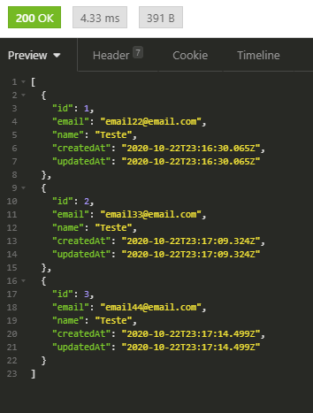

<p  align="center">

  

  

<a  href="http://nestjs.com/"  target="blank"></a>

  

  

</p>

  

  

  

## Descrição

  

  

  

Teste de backend feito em NestJS

  

  

Esta aplicação utiliza TypeORM e Postgres como banco de dados Principal.

  

  

Foram utilizadas as boas práticas conforme orientadas pelo framework, com o código dividido em módulos, onde cada módulo possui subpastas para alocar os *Controllers, Services, Repositories e Entities* entre outro. Dessa forma, têm-se agrupado os arquivos de mesmas categorias, ficando apenas os arquivos **.modules.ts* na raiz de cada módulo.

  

  

  


  

  

  

Também foi inserido o arquivo Dockerfile ao projeto para facilitar a criação de imagem Docker deste projeto.

  

  

## Instalação

  

  

  

Primeiro baixe o projeto usando o git

  

  

```bash
$ git clone <repo>
```

  

  

Após baixar o repositório, navegue até a pasta do projeto e dê o comando

  

```bash
$ npm install
```

  

  

  

## Configurações
Com um editor de texto de sua preferência, edite o arquivo `src\config\typeorm.config.ts` e insira as configurações referentes à conexão com o banco de dados Postgres.

  

  

  


  

  

  

## Execução

  

  

Para dar início à aplicação, escolha um dos três modos a seguir

  

  

```bash
# Desenvolvimento
$ npm run start

# Desenvolvimento com atualizações a cada alteração
$ npm run start:dev

# Produção
$ npm run start:prod
```

  

  

Quando executando em modo de desenvolvimento com atualizações a cada alteração, o terminal deve apresentar resultado semelhante à este:

  

  


  

  

## Acessando o sistema

O sistema irá executar em `http://localhost:3000`

A documentação das rotas disponíveis pode ser encontrada em `http://localhost:3000/swagger/`

  
  


  

É possível testar os endpoints da aplicação pela própria documentação ou por outros clientes rest, no caso dos prints a seguir, foi o usado o Insomnia.

  
##### Users index


  
  
##### User Profile


  
  
##### User Register


  
  
##### Post Create


  
  
##### Posts Index


  
  
  

## Testes

  

  

Para esta aplicação foram escritos testes unitários que verificam a integridade do código.

  

  

  

> Os testes devem executar sem apresentar erros.

  

  

  

```bash
# Testes unitários
$ npm run test
```

  

  

  

## Licença

  

  

  

Nest is [MIT licensed](LICENSE).
